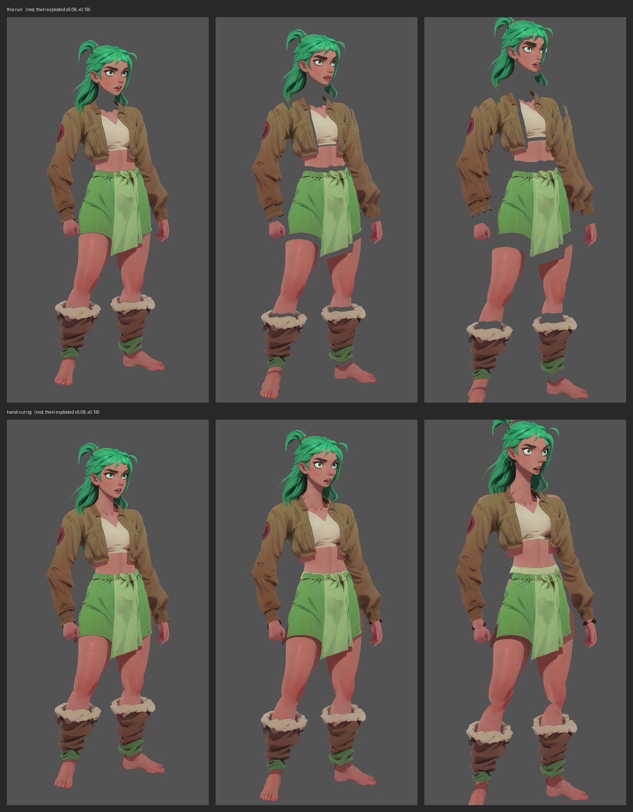

# 2D AutoSplit Studio

Turn a flat 2D character illustration into named, z-ordered, anatomically labeled part PNGs and a Spine 4.3 project, with one click in Krita.

Before a rigger can start rigging, someone has to cut the character up: separate the arms from the torso, the hair from the face, the irises from the eyes, name every piece, and stack them in the right draw order. On a detailed character that is roughly **two hours of manual work in Photoshop**. This does the cut in one click and hands the result back three ways: as named layers inside Krita, as part PNGs on disk, and as a Spine project you can import and start rigging.

Built by [Jeffrey R. De La Nuez](https://jrdelanuez.com), a technical artist with 10+ years of production character rigging in Spine 2D. The problem is one I hit on every single character I have ever rigged.



*Top: the tool's cut of Salena, at rest and pulled apart. Bottom: the hand-cut production rig of the same character. At rest the two match. Pulled apart, the hand-cut parts carry painted-in hidden regions (the legs continue under the skirt, the torso under the jacket) and the tool's parts do not yet. That gap is the next milestone; see [Limitations](#limitations).*

---

## How good is it

Every change is measured against a real production rig: the layered PSD of the character above, cut by hand, used as ground truth (`tools/evaluate.py`). 27 parts, 17 body and 9 facial plus the sash.

| | Before Phase 1 | Now |
|---|---|---|
| Parts found | 26 of 27 | **27 of 27** |
| Mean mask IoU | 0.69 | **0.75** |
| Boundary F-score (3 px) | 0.71 | **0.76** |
| Left/right named correctly | 94% | **100%** |
| Draw order, overlapping pairs correct | 76% | **89%** |
| Draw order, weighted by overlap area | 64% | **97%** |

Exported to Spine and reassembled from the JSON alone, the parts land where they were cut from: mean colour error 0.07 / 255 against the source picture, with no manual nudging.

The parts that still score low swallow a neighbour. SAM 3's "jacket" includes both sleeves, which a rig keeps on the arm parts; "skirt" includes the sash lying on top of it; "face" keeps the eyelids, which this rig cuts as layers of their own. Most of the draw-order misses that remain are small contact areas (feet against legs, a lock of hair against a sleeve), plus one large one: the far arm is drawn in front of the torso.

---

## What it does

**The pipeline** (ComfyUI, custom nodes in this repo)

1. **Depth.** Depth Anything V2 estimates which parts of the picture are closer to the viewer.
2. **Body pass.** SAM 3 text-grounded segmentation, one text label per part. The picture is encoded once and every phrasing reuses it, every instance SAM 3 finds is kept, and a label that finds nothing gets one retry at a lower confidence (flagged `low_confidence` in the metadata, and refused if it only repeats a part already found).
3. **Left and right from geometry.** For "left arm" / "right arm" the instances from both labels are pooled and the sides are assigned by position, anatomically by default (the character's own left, which sits on the viewer's right). Back views flip it. SAM 3 alone is unreliable about "left".
4. **Hair** splits into `hair_front` and `hair_back` by connected pieces, or by depth when it comes back as one piece.
5. **Mask cleanup.** Morphological close, enclosed holes filled, stray islands dropped.
6. **Draw order from evidence.** For every overlapping pair: whose colours fill the shared pixels, whether one part encloses the other, and which side the depth map says is nearer at the contact. The usual rigger stacking (eyes over face, hair behind, and so on) only breaks ties. Contradictions are resolved without cycles.
7. **Facial detail.** The head is cropped and upscaled 2x, a second pass finds eyes, irises, eyebrows, nose and lips, and their positions are mapped back to the full picture. Facial parts slot in directly in front of the face, not on top of everything.
8. **Output.** Each run writes to its own folder, `<output_directory>/<run_id>/`, with part PNGs and `parts_metadata.json` (schema 2: full-image boxes, draw index, flags, what each part is in front of, and why).

**In Krita**, **Split Character** runs the workflow on a background thread, imports each part as a named layer at its position in draw order, and reports anything flagged. **Export to Spine** writes a Spine 4.3.22 skeleton: root bone, one slot and region attachment per part, default skin, the same draw order.

A worked example is committed in [`examples/salena/`](examples/salena/): the 27 part PNGs and the Spine JSON from the run measured above.

---

## Repo contents

| Path | What it is |
|---|---|
| `ComfyUI-AutoSplit-Orchestrator/` | The custom ComfyUI nodes: `AutoSplitOrchestratorSAM3` (the main orchestrator), `HeadCropUpscale`, `AsymmetricMaskExpand`, `SplitLeftRight`, and the legacy SAM 2 orchestrator. |
| `ComfyUI-AutoSplit-Orchestrator/autosplit_core/` | The logic the node uses, free of ComfyUI so it can be tested on its own: mask cleanup, left/right assignment, evidence-based draw order, facial merge. |
| `krita_plugin/autosplit_studio/` | The Krita plugin: a docker with **Split Character**, **Export to Spine** and **Generate Skin**. Standard library only, so it runs in Krita's bundled Python with nothing to install. |
| `krita_plugin/autosplit_studio/comfy_client.py` | The ComfyUI client every entry point shares: upload, queue with a run id, wait, read the run's metadata, place parts, order them. |
| `2D_Character_AutoSplit_SAM3.json` | The ComfyUI workflow in API format. |
| `comfy_autosplit_test.py` | Runs a split from a terminal, without Krita. |
| `spine_export.py` | Writes a Spine project from a run (`--run-id`, or `--body` / `--face` folders). |
| `tools/` | Ground truth from a layered PSD (`gt_from_psd.py`), scoring (`evaluate.py`), the exploded-view sheet above (`wiggle.py`), offline re-ordering of old runs (`reorder_run.py`), and `link_dev_install.cmd`. |
| `tests/` | Unit tests for `autosplit_core` and a smoke test of the node with a fake SAM 3. |
| `examples/salena/` | Sample output: part PNGs and the Spine skeleton JSON. |
| `restyle_test.py`, `Flux_Klein_Krita_Inpaint.json`, `NovaAnimeXL_Krita_Inpaint.json` | The restyle path behind **Generate Skin**. Being rebuilt; see Limitations. |

---

## Requirements

- **ComfyUI** running locally on port `8188` (tested on 0.38)
- ComfyUI custom nodes: [`comfyui-easy-sam3`](https://github.com/yolain/ComfyUI-Easy-Sam3) (SAM 3 loader) and `comfyui_controlnet_aux` (Depth Anything V2). The workflow's report display uses `ComfyUI-Easy-Use`, which is optional.
- **Krita 5.x** for the plugin (optional; the terminal driver works without it)
- **Spine 4.3+** to import the exported skeleton (tested against 4.3.22)
- Python: the plugin and `comfy_autosplit_test.py` need only the standard library. `spine_export.py` needs Pillow. The scripts in `tools/` need `pip install -r tools/requirements.txt`.

## Setup

1. Put the node package and the plugin where ComfyUI and Krita look for them. On Windows, the simplest way is to close ComfyUI and Krita and run

   ```
   tools\link_dev_install.cmd
   ```

   It links `ComfyUI\custom_nodes\ComfyUI-AutoSplit-Orchestrator` and Krita's `pykrita\autosplit_studio` to this repo with directory junctions (no admin rights needed), moving any older copies to a dated backup folder first. `tools\link_dev_install.cmd unlink` removes the links. It finds ComfyUI through `AUTOSPLIT_COMFY_ROOT`, or the Easy-Install layout beside the repo.

   Elsewhere, copy (or symlink) `ComfyUI-AutoSplit-Orchestrator/` into `ComfyUI/custom_nodes/`, and `krita_plugin/autosplit_studio/` plus `autosplit_studio.desktop` into Krita's `pykrita` folder.
2. Restart ComfyUI. To look at the graph, drag `2D_Character_AutoSplit_SAM3.json` onto the ComfyUI canvas.
3. In Krita, enable **AutoSplit Studio** in the Python Plugin Manager and restart Krita.
4. If ComfyUI is not in the default place, set the environment variables below. No source edits are needed.

### Configuration

| Variable | What it sets | Default |
|---|---|---|
| `AUTOSPLIT_PROJECT` | This repo's folder | found from the plugin's real location (follows the junction) |
| `AUTOSPLIT_COMFY_ROOT` | Your ComfyUI install root | `<repo>/../AI Work/ComfyUI-Easy-Install/ComfyUI`, then `<repo>/../ComfyUI-Easy-Install/ComfyUI` |
| `AUTOSPLIT_COMFY_URL` | ComfyUI server address | `http://127.0.0.1:8188` |
| `AUTOSPLIT_COMFY_OUTPUT` | ComfyUI output folder | `<COMFY_ROOT>/output` |
| `AUTOSPLIT_WORKFLOW` | Workflow the plugin runs | `<project>/2D_Character_AutoSplit_SAM3.json` |
| `AUTOSPLIT_INPUT` | Image for the terminal driver | `<project>/input/character.png` |
| `AUTOSPLIT_OUT` | Where Spine output is written | `<project>/spine_export` (not committed) |
| `AUTOSPLIT_CHARACTER` | Skeleton name for `spine_export.py` | `character` |

## Use

Open a flat character image in Krita and click **Split Character**. Each split gets its own run id, so a new run never mixes with an old one. Then click **Export to Spine**, import the JSON into Spine with **Import Data**, and point the images path at the `images/` folder beside it. The character arrives assembled and ready to rig.

Without Krita:

```
python comfy_autosplit_test.py path\to\character.png
python spine_export.py --run-id <the run id it printed> --character MyCharacter
```

### Measuring a change

```
python tools/gt_from_psd.py <layered.psd> --group <view group> --out <gt folder>
python tools/evaluate.py --gt <gt folder> --map tools/gt_maps/<map>.json --run <body run> --run <facial run>
python tools/wiggle.py --run <body run> --run <facial run> --gt <gt folder> --out sheet.png
python tests/test_core.py && python tests/test_node_smoke.py
```

The map file ties the tool's part names to the PSD's layer names (`tools/gt_maps/salena_fa.json` is the example).

---

## Limitations

- **Hidden-region fill is a prototype outside the node.** Each part is the pixels you can see, so pulling the parts apart shows holes where one part covered another (the exploded view above). `tools/run_fill.py` fills them by "peeling": Flux.2 Klein edits of the picture with the front layers removed in the same pose, planned from the part labels and draw order (no per-character prompts), split again with SAM 3 and merged into the hidden areas. On Salena it scores Rig Match 0.616 against the hand-cut rig (0.470 without fill; 0.624 with hand-written prompts). It needs a running ComfyUI with the Klein 4B and 9B models:

  ```
  python tools/run_fill.py --run <body run> --run <facial run> --source <picture> [--base-layer "a light green sports bra and briefs"]
  ```

  `--base-layer` is the rig's convention for what the base body wears (default: a plain sports top and briefs). The old OpenCV fill is still in the node (`enable_inpainting`) but off by default, because it leaves grey smears.
- **One ground-truth character so far.** The numbers above are one character, one view. More hand-cut rigs are needed before the draw-order weights can be trusted beyond it.
- **Parts that contain a neighbour** (jacket with sleeves, skirt with sash) are kept as SAM 3 returns them; deciding which part owns the shared pixels is not done yet.
- **Generate Skin is being rebuilt.** Its checkpoints were retired; the restyle path will move to Flux Klein.
- Quality tracks the source art. Flat, clearly separated character art segments well. Heavy overlap, painterly rendering and busy backgrounds do not.
- Coordinates: image space is y-down from the top-left and Spine is y-up. The exporter puts the origin at the character's bounding-box bottom-centre so the feet land near y=0; facial parts, cut from the 2x crop, are scaled back by `1/scale` and offset by the crop origin.
- A first version was built in 2024 and **shelved**, because the segmentation models of that era could not cut the art cleanly enough to trust in production. Shipping something unreliable into an artist's daily workflow costs more trust than it saves time. It was picked back up in 2026 once the models had caught up.

## License

[MIT](LICENSE). The Salena artwork in `examples/` and `docs/` is the author's own and is included as sample data.
